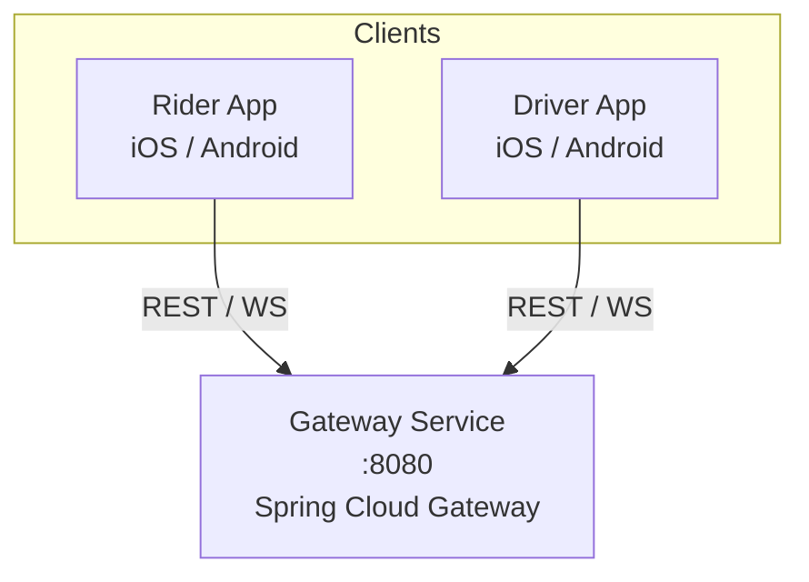
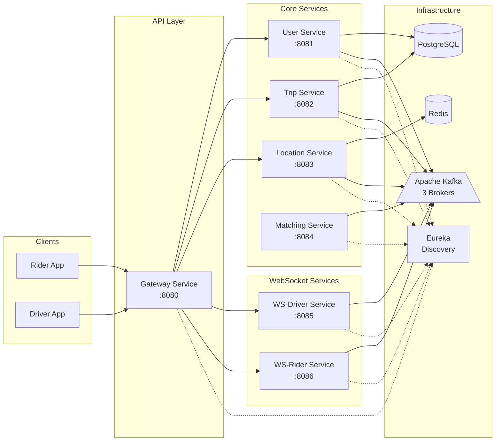
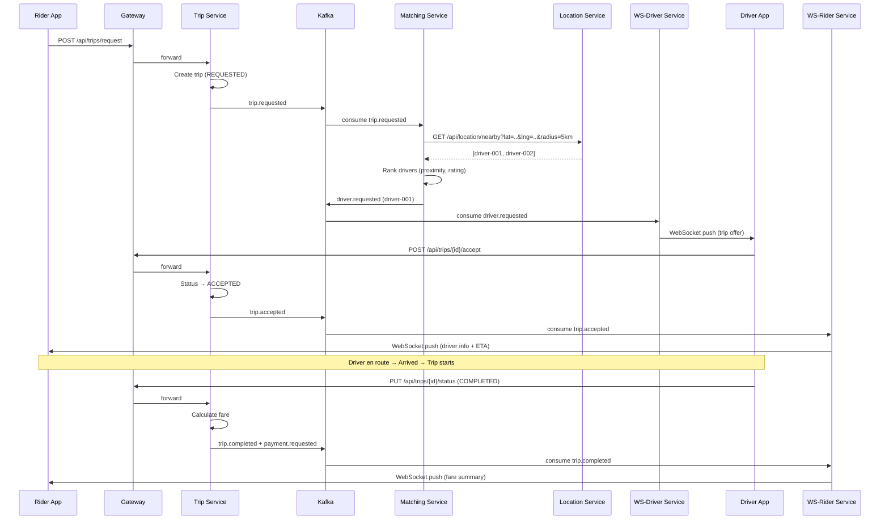
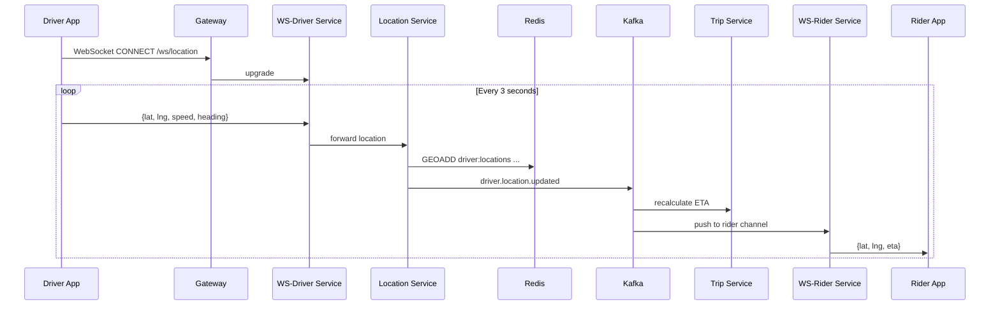
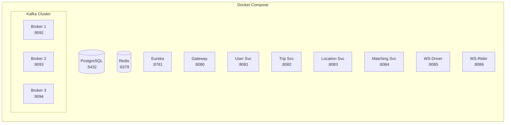

# Architecture – MVP

> High-level architecture diagram for the Ride Sharing Platform MVP.
>
> **Note:** Since a binary `.png` can't be generated in-repo, this file contains
> a **Mermaid** diagram that renders in GitHub, GitLab, and VS Code (with the
> Mermaid extension). To export as PNG, paste the diagram into
> [mermaid.live](https://mermaid.live) or run `mmdc -i architecture-mvp.md -o architecture-mvp.png`.

---

## System Context

---

## Container Diagram

---

## Trip Lifecycle – Sequence Diagram

---

## Location Tracking – Sequence Diagram

---

## Infrastructure Topology (Docker Compose)

---

## Technology Stack Summary

| Layer | Technology |
|-------|-----------|
| API Gateway | Spring Cloud Gateway (Netty) |
| Core Services | Spring Boot 3.2, Java 17 |
| Reactive WebSocket | Spring WebFlux |
| Service Discovery | Netflix Eureka |
| Message Broker | Apache Kafka (KRaft mode, 3 brokers) |
| Primary Database | PostgreSQL 16 |
| Cache / Geo-Index | Redis 7 |
| Resilience | Resilience4j (circuit breaker) |
| Rate Limiting | Spring Cloud Gateway + Redis |
| Containerisation | Docker Compose (dev), Kubernetes (prod) |
| Auth | JWT (issued by User Service) |
| Build | Maven |

---

## Port Assignments

| Service | Port |
|---------|------|
| Gateway | 8080 |
| User Service | 8081 |
| Trip Service | 8082 |
| Location Service | 8083 |
| Matching Service | 8084 |
| WS-Driver Service | 8085 |
| WS-Rider Service | 8086 |
| Eureka | 8761 |
| Kafka Broker 1 | 9092 |
| Kafka Broker 2 | 9093 |
| Kafka Broker 3 | 9094 |
| PostgreSQL | 5432 |
| Redis | 6379 |
